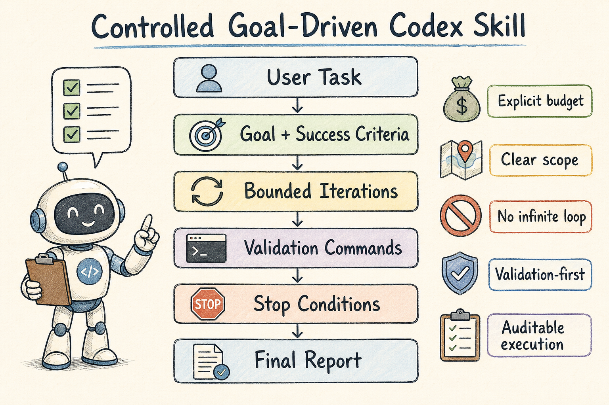

<div align="center">

# Controlled Goal-Driven Codex Skill

**A practical, bounded, validation-first Codex skill for complex engineering tasks.**

[Chinese README](./README.zh-CN.md) · [Original Inspiration](https://github.com/lidangzzz/goal-driven)

</div>

---

## Overview



This repository packages a controlled goal-driven workflow as a small Codex skill project. It is meant for tasks where progress can be validated, iteration is useful, and stopping conditions matter.

## What is this?

This skill converts a broad engineering request into a bounded loop:

1. clarify the goal
2. define success criteria
3. stay inside the allowed editing scope
4. run validation commands
5. iterate only while progress is measurable
6. stop with a concise final report

Core idea:

> Do not just try harder. Work toward a clear goal, validate results, and stop when further attempts are not justified.

## Installation

Copy the `skill/` directory into your Codex skills folder. For example:

```text
~/.agents/skills/controlled-goal-driven/
```

The final structure should be:

```text
~/.agents/skills/controlled-goal-driven/SKILL.md
~/.agents/skills/controlled-goal-driven/agents/openai.yaml
```

Implicit invocation is disabled by design. Invoke the skill explicitly:

```text
$controlled-goal-driven
```

## Usage

```text
$controlled-goal-driven

Goal:
Fix the parser so all syntax tests pass.

Success criteria:
- npm test passes
- no unrelated files modified
- maximum 3 iterations
- stop if the same error repeats twice
```

## When to use / When not to use

Use this skill when:

- the task has objective success criteria
- validation commands exist
- the allowed editing scope is clear
- repeated iterations can improve the result

Do not use this skill when:

- the goal is vague
- success is based only on taste or vibes
- there is no validation command
- the user only needs a simple one-shot answer

## Why this version exists

This workflow is inspired by [Li Dang (@lidangzzz)](https://x.com/lidangzzz)'s [goal-driven](https://github.com/lidangzzz/goal-driven) pattern, but this project focuses more on safety, controllability, and auditable execution in Codex.

Compared with open-ended looping prompts, this skill adds:

- explicit iteration budgets
- mandatory validation commands
- clear stop conditions
- strict scope awareness
- concise final reporting
- conservative defaults when user constraints are missing

## Why not run forever?

Long-running workflows only make sense if success can be validated.

Good examples:

```bash
npm test
pytest
cargo test
make test
go test ./...
```

Bad examples:

```text
Make this project better.
Keep optimizing until it feels good.
```

If the goal is vague, the skill should plan and stop rather than consume tokens indefinitely.

## Recommended input format

```text
Goal:
The concrete thing Codex should accomplish.

Success criteria:
How to know the task is complete.

Validation:
Commands Codex should run to verify progress.

Scope:
Files or directories Codex may edit.

Budget:
Maximum number of iterations or attempts.

Stop conditions:
When Codex should stop and report instead of continuing.
```

## Examples

- [Test-driven bug fix](./examples/test-driven-bugfix.md)
- [Refactor with scope](./examples/refactor-with-scope.md)
- [Generated test validation](./examples/generated-test-validation.md)

## Final report should include

- Goal
- Changes made
- Validation results
- Remaining issues
- Recommended next action

## Acknowledgement

Inspired by Li Dang's original goal-driven workflow:

- GitHub: [lidangzzz/goal-driven](https://github.com/lidangzzz/goal-driven)
- X: [@lidangzzz](https://x.com/lidangzzz)

This repository is an independent, controlled adaptation for safer Codex usage.
