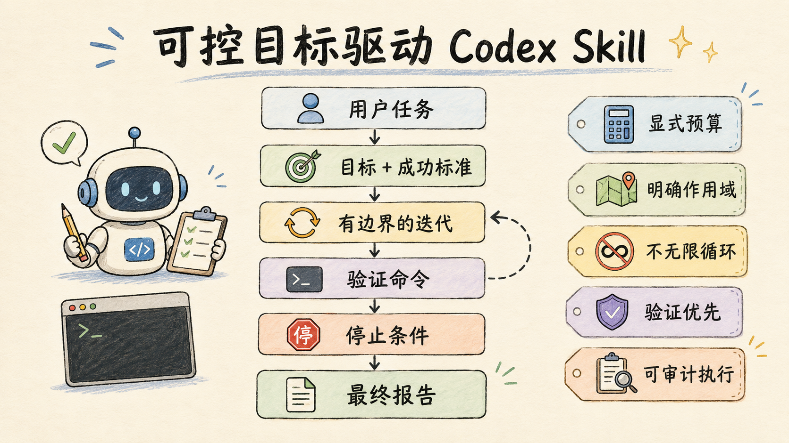

<div align="center">

# Controlled Goal-Driven Codex Skill（中文版）

**一个面向复杂工程任务、强调边界与验证的 Codex 实用技能。**

[English README](./README.md) · [灵感来源](https://github.com/lidangzzz/goal-driven)

</div>

---

## 概览



本仓库将可控的目标驱动工作流打包为一个小型 Codex Skill 项目。它适合用于进展可验证、迭代有意义、并且需要明确停止条件的任务。

## 这是什么？

这个技能会把宽泛的工程请求转化为一个有边界的循环：

1. 明确目标
2. 定义成功标准
3. 遵守允许修改的作用域
4. 运行验证命令
5. 只在进展可衡量时继续迭代
6. 最后输出简洁报告

核心思想：

> 不只是“更努力地试”，而是围绕明确目标推进、持续验证，并在不值得继续时及时停止。

## 安装

将 `skill/` 目录复制到 Codex skills 目录中，例如：

```text
~/.agents/skills/controlled-goal-driven/
```

最终结构应为：

```text
~/.agents/skills/controlled-goal-driven/SKILL.md
~/.agents/skills/controlled-goal-driven/agents/openai.yaml
```

该技能有意禁用隐式调用。请显式调用：

```text
$controlled-goal-driven
```

## 使用方式

```text
$controlled-goal-driven

Goal:
Fix the parser so all syntax tests pass.

Success criteria:
- npm test passes
- no unrelated files modified
- maximum 3 iterations
- stop if the same error repeats twice
```

## 何时使用 / 何时不使用

适合使用这个技能的情况：

- 任务有客观成功标准
- 存在验证命令
- 允许修改的作用域清晰
- 多次迭代可以改善结果

不适合使用这个技能的情况：

- 目标很模糊
- 成功只取决于审美或感觉
- 没有验证命令
- 用户只需要一次性的简单回答

## 为什么要做这个版本

该工作流灵感来自 [Li Dang（@lidangzzz）](https://x.com/lidangzzz) 的 [goal-driven](https://github.com/lidangzzz/goal-driven) 模式，但本项目更强调在 Codex 中的安全性、可控性与可审计性。

相较于开放式循环提示词，这个技能增加了：

- 显式迭代预算
- 强制验证命令
- 明确停止条件
- 严格作用域意识
- 简洁最终报告
- 在缺少约束时使用保守默认值

## 为什么不无限运行？

只有在成功可验证时，长流程才有意义。

合理示例：

```bash
npm test
pytest
cargo test
make test
go test ./...
```

不合理示例：

```text
把这个项目变得更好。
一直优化到感觉不错为止。
```

如果目标本身模糊，技能应当先产出计划并停止，而不是无限消耗 token。

## 推荐输入模板

```text
Goal:
Codex 要完成的具体目标。

Success criteria:
如何判断任务完成。

Validation:
用于验证进展的命令。

Scope:
允许修改的文件或目录范围。

Budget:
最多允许的迭代或尝试次数。

Stop conditions:
何时应停止并报告，而不是继续尝试。
```

## 示例

- [基于测试的 Bug 修复](./examples/test-driven-bugfix.md)
- [带作用域的重构](./examples/refactor-with-scope.md)
- [生成测试并验证](./examples/generated-test-validation.md)

## 最终报告建议包含

- 目标
- 已完成修改
- 验证结果
- 剩余问题
- 下一步建议

## 致谢

本项目灵感来自 Li Dang 的目标驱动工作流：

- GitHub: [lidangzzz/goal-driven](https://github.com/lidangzzz/goal-driven)
- X: [@lidangzzz](https://x.com/lidangzzz)

本仓库是面向 Codex 的独立、可控改写版本。
