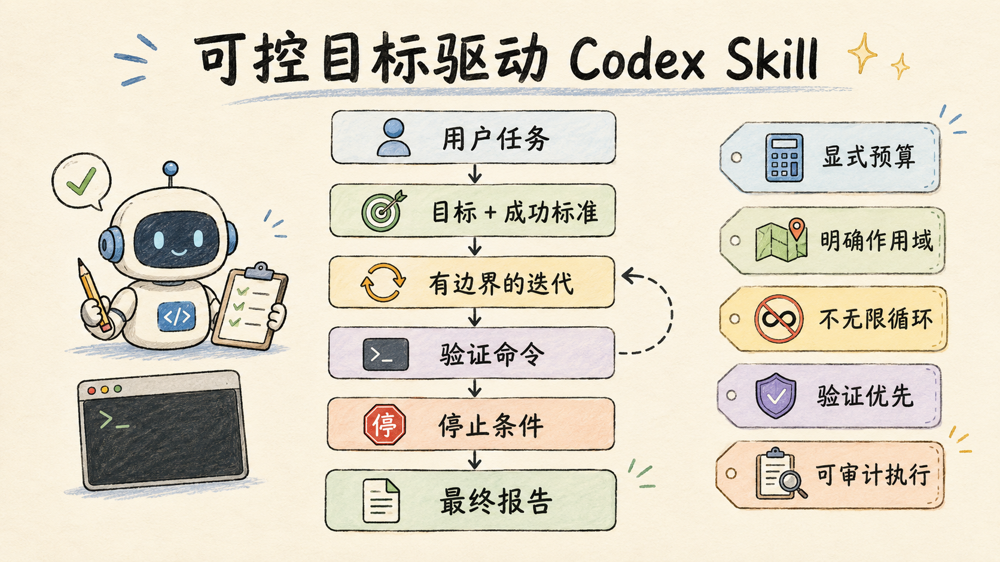

<div align="center">

# Controlled Goal-Driven Codex Skill（中文版）

**一个面向复杂工程任务、强调边界与验证的 Codex 实用技能。**

当前版本：**1.4.0**。参见[更新记录](./CHANGELOG.md)。

[English README](./README.md) · [灵感来源](https://github.com/lidangzzz/goal-driven)

</div>

---

## 🌟 概览



本仓库将可控的目标驱动工作流打包为一个小型 Codex Skill 项目。它适合用于进展可验证、迭代有意义、并且需要明确停止条件的任务。

## 🤔 这是什么？

这个技能会把宽泛的工程请求转化为一个有边界的循环：

1. 明确目标
2. 定义成功标准
3. 遵守允许修改的作用域
4. 运行验证命令
5. 只在进展可衡量时继续迭代
6. 最后输出简洁报告

核心思想：

> 不只是“更努力地试”，而是围绕明确目标推进、持续验证，并在不值得继续时及时停止。

v1.1 区分**单项检查结果**（PASS / FAIL / BLOCKED / NOT_RUN）、**每轮进展**（PROGRESS / NO_PROGRESS / REGRESSION / UNKNOWN）及**最终终止状态**（SUCCESS / NO_PROGRESS / REGRESSION / BLOCKED / BUDGET_EXHAUSTED / NEEDS_DECISION）。只要有可比较的客观进展，同一错误连续出现并不自动触发停止。

## 🛠️ 安装

使用源码时，在仓库根目录执行以下命令。目标目录必须尚不存在；已有安装请先按下文的更新步骤操作。

Windows PowerShell：

```powershell
$skillDir = Join-Path $env:USERPROFILE '.agents\skills\controlled-goal-driven'
if (Test-Path -LiteralPath $skillDir) { throw '已有安装：请先备份并检查本地修改，再更新。' }
New-Item -ItemType Directory -Force -Path (Split-Path -Parent $skillDir) | Out-Null
Copy-Item -LiteralPath .\skill -Destination $skillDir -Recurse
python "$skillDir\scripts\check_install.py" --expected-version 1.4.0
```

macOS / Linux（Bash）：

```bash
skill_dir="$HOME/.agents/skills/controlled-goal-driven"
if [ -e "$skill_dir" ] || [ -L "$skill_dir" ]; then
  printf '%s\n' '已有安装：请先备份并检查本地修改，再更新。' >&2
else
  mkdir -p "$HOME/.agents/skills" && cp -R skill "$skill_dir" &&
    python3 "$skill_dir/scripts/check_install.py" --expected-version 1.4.0
fi
```

也可从[发布页面](https://github.com/Qrzzzz/goal-driven-codex-skill/releases/latest)下载安装 ZIP，使用配套 `.sha256` 文件核对后，将其中的 `controlled-goal-driven/` 文件夹解压到 skills 目录。不要多套一层目录，也不要覆盖现有安装。最终结构应为：

```text
~/.agents/skills/controlled-goal-driven/SKILL.md
~/.agents/skills/controlled-goal-driven/VERSION
~/.agents/skills/controlled-goal-driven/agents/openai.yaml
~/.agents/skills/controlled-goal-driven/references/
~/.agents/skills/controlled-goal-driven/scripts/check_scope.py
~/.agents/skills/controlled-goal-driven/scripts/check_install.py
```

该技能有意禁用隐式调用。请显式调用：

```text
$controlled-goal-driven
```

检查脚本使用 Python 3.11+，无需第三方包或付费服务。可以从**任意目录**运行，默认检查脚本所在的安装目录，核对版本、Skill 声明名称、随包提供的显式调用策略和递归本地引用。它只读文件，发现安装不完整或版本不符时返回非零退出码；它不是通用 YAML 校验器，也不能证明 Codex 已发现该技能。没有 Python 时，可手动检查 `VERSION`、`SKILL.md` 和 `agents/openai.yaml` 中的 `policy.allow_implicit_invocation: false`，然后在 Codex 中显式调用。

如果 Codex 找不到技能，请确认 `SKILL.md` 直接位于 `controlled-goal-driven/` 下，使用当前 Codex 配置的 skills 目录，并在安装后新建聊天。最后用一个边界清楚的小任务显式调用，以确认发现和加载正常；离线脚本无法代替这一步。

### 更新、回滚和卸载

更新前先读取已安装的 `VERSION`，并比较**整个安装目录**与准备使用的源码／发行包。本地定制必须经过检查后有意保留；直接覆盖可能丢失修改，也可能留下过时文件。

1. 下载或检出目标版本，在独立目录运行 `check_install.py --expected-version 1.4.0` 检查；未来发行时替换为对应版本号。
2. 将当前安装整体移动到 **skills 目录以外、尚不存在的新备份位置**，保留所有文件。只保留一份同名已安装 Skill；扫描目录内的备份可能造成重复发现。
3. 按上面的命令安装到已腾空的目标位置。有意迁移经过检查的定制内容，再运行检查脚本，并在 Codex 中显式调用小任务。确认之前保留备份。
4. 回滚时，将新安装移动到 skills 目录外的另一个备份位置，再将原文件夹恢复到原路径，并按原版本校验。不要合并目录或重置无关文件。

可逆卸载方式：只将 `controlled-goal-driven/` 文件夹移动到 skills 目录之外，然后新建聊天；确认不再需要后，再删除该确切备份。另行批准的私有路径中的检查点独立存在，如需清除，应单独检查和处理。

维护者打标签或发布前，请使用[发布验证清单](./docs/releasing.md)。

## 🚀 使用方式

```text
$controlled-goal-driven

Goal:
修复解析器的嵌套表达式问题。

Success criteria:
- 解析器测试及新增回归测试通过
- 不改变无关行为和文件

Validation:
- npm test -- parser

Scope:
- src/parser/**, tests/parser/**

Budget:
- 最多 3 轮修改与验证

Stop conditions:
- 连续两轮可比较的执行没有进展时停止
- 验证受阻或必须扩大修改范围时停止
```

## 🔎 v1.2 验证与修改范围检查

新版核心指令采用精简结构，详细规则存放在[按需加载的参考文件](./skill/references/)中。新增可选的 **Git Scope 检查器**，可识别修改前已有的用户变更；即使无法运行检查器，也必须遵守用户指定的修改范围。

在 Git 项目内、开始修改前执行：

```bash
python skill/scripts/check_scope.py snapshot
```

每轮修改后检查：

```bash
python skill/scripts/check_scope.py check --allow 'src/parser/**' --allow 'tests/parser/**'
```

检查器覆盖已暂存、未暂存、未跟踪、删除和重命名的路径，不会自动回滚文件。它属于辅助核查工具，并非安全沙箱。参见 [Scope 检查说明](./skill/references/scope-check.md) 与 [基线及回归验证](./skill/references/baseline-and-validation.md)。

无需 API 密钥即可运行离线测试：

```bash
python -m unittest discover -s tests -v
```

**这些离线测试不会验证 Codex 的真实行为。** 另有[行为评测指南](./docs/evaluation.md)，包含需要手动或选择性运行的评测场景。

## 🧮 v1.3 资源预算与显式恢复

默认仍为 **3 轮实现迭代**，**额外验证重试为 0 次**。可选设置整个任务的诊断重试次数、累计执行时间、单条命令超时，以及能够可靠观测的用量上限。重试必须有具体的瞬时故障假设；确定性错误需要修改实现。预算耗尽时报告具体维度，无法观测的 token 或费用保持未知。参见[资源预算说明](./skill/references/resource-budgets.md)。

检查点存储是可选项，必须明确启用并指定用户认可的位置。后续显式恢复时，核对目标、范围、仓库、分支、HEAD 及脏文件指纹，并在剩余预算内重新验证。契约发生变化时需要用户决策；已消耗的迭代与重试不会归零。[会话状态协议](./skill/references/session-state.md)及[虚构 JSON 示例](./skill/references/session-state.example.json)说明如何手动保存证据记录，不会启动后台执行，也不保存凭据。

在普通 Goal/Scope/Validation 字段之外，可选增加：

```text
Budget: 最多 3 轮实现；整个任务最多 1 次诊断重试；累计执行 600 秒；单条命令 60 秒。
State: 明确启用检查点存储，位置为 <已认可的私有路径>。
```

## ✅❌ 何时使用 / 何时不使用

适合使用这个技能的情况：

- 任务有客观成功标准
- 存在可执行检查或可独立核验的证据
- 允许修改的作用域清晰
- 多次迭代可以改善结果

不适合使用这个技能的情况：

- 目标很模糊
- 成功只取决于审美或感觉
- 没有可信的验证方法
- 用户只需要一次性的简单回答

## 💡 为什么要做这个版本

该工作流灵感来自 [Li Dang（@lidangzzz）](https://x.com/lidangzzz) 的 [goal-driven](https://github.com/lidangzzz/goal-driven) 模式，但本项目更强调在 Codex 中的安全性、可控性与可审计性。

相较于开放式循环提示词，这个技能增加了：

- 显式迭代预算
- 强制提供验证证据
- 明确停止条件
- 严格作用域意识
- 简洁最终报告
- 在缺少约束时使用保守默认值

## ⏱️ 为什么不无限运行？

只有在成功可验证时，长流程才有意义。

合理示例：

```bash
npm test
pytest
cargo test
make test
go test ./...
```

不合理示例：

```text
把这个项目变得更好。
一直优化到感觉不错为止。
```

如果目标本身模糊，技能应当先产出计划并停止，而不是无限消耗 token。

## 🧭 推荐输入模板

```text
Goal:
Codex 要完成的具体目标。

Success criteria:
如何判断任务完成。

Validation:
用于验证进展的命令。

Scope:
允许修改的文件或目录范围。

Budget:
最多允许的迭代或尝试次数。

Stop conditions:
何时应停止并报告，而不是继续尝试。
```

## 📚 示例

- [基于测试的 Bug 修复](./examples/test-driven-bugfix.md)
- [带作用域的重构](./examples/refactor-with-scope.md)
- [生成测试并验证](./examples/generated-test-validation.md)
- [v1.1 决策场景与预期终止状态](./examples/decision-traces.md)
- [v1.2 测试与行为评测流程](./docs/evaluation.md)

## 📝 最终报告建议包含

- 终止状态与原因
- 目标、允许范围及修改内容
- 修改前基线、最终证据及迭代次数
- 各成功标准的已验证 / 未满足 / 未验证状态
- 验证命令及 PASS / FAIL / BLOCKED / NOT_RUN 结果
- 剩余问题和下一步建议

## 🙏 致谢

本项目灵感来自 Li Dang 的目标驱动工作流：

- GitHub: [lidangzzz/goal-driven](https://github.com/lidangzzz/goal-driven)
- X: [@lidangzzz](https://x.com/lidangzzz)

本仓库是面向 Codex 的独立、可控改写版本。
